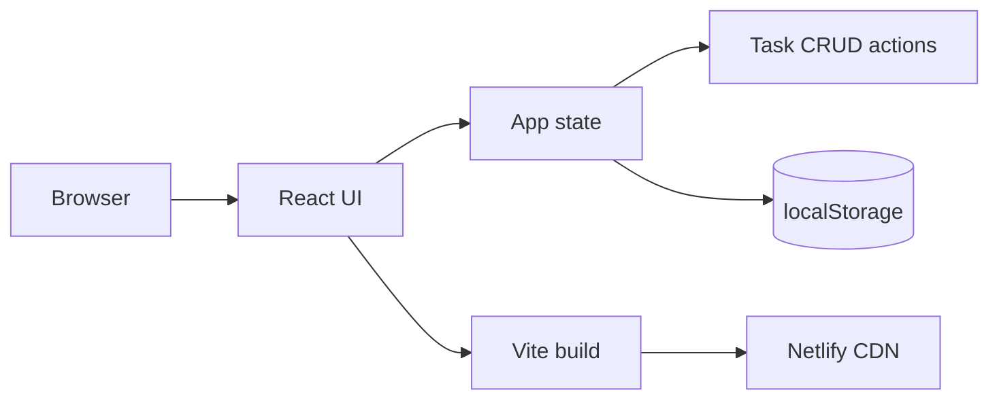
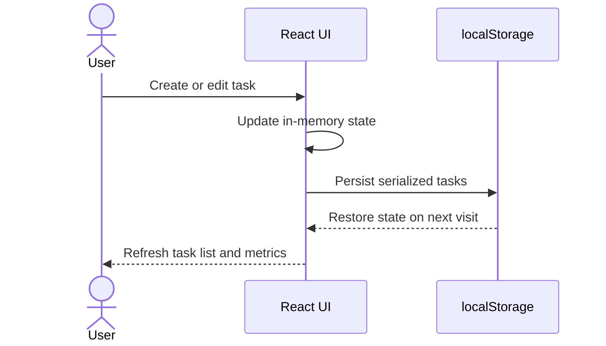

# TaskForge

TaskForge is a polished SaaS task manager capstone built with React and Vite. It gives an individual workspace a fast, focused home for projects, priorities, and daily execution.

## Live deployment

Deploy this repository with Netlify using the settings below:

- **Build command:** `npm run build`
- **Publish directory:** `dist`
- **Node version:** `20`

The repository is ready for a public deploy at [Rajib-CST/rajib4.0](https://github.com/Rajib-CST/rajib4.0).

## Features

- Simulated workspace authentication/profile menu
- Project navigation for Overview, Today, Northstar, TaskForge, and Launchpad
- Task CRUD: create, edit, delete, and cycle status
- Search and status filtering
- Responsive desktop and mobile layouts
- Persistent task state with browser `localStorage`
- Production build configured for Netlify

## Architecture





## Local setup

```bash
npm install
npm run dev
```

Create a production build with:

```bash
npm run build
npm run preview
```

## Deployment

1. Push the project to `https://github.com/Rajib-CST/rajib4.0`.
2. In Netlify, select **Add new site** and **Import an existing project**.
3. Choose GitHub and authorize access to the repository.
4. Select `Rajib-CST/rajib4.0`.
5. Use `npm run build` for the build command and `dist` for the publish directory.
6. Click **Deploy site**.
7. Copy the generated `https://...netlify.app` URL into your capstone submission.

No environment variables are required because this capstone intentionally uses simulated authentication and browser persistence.
